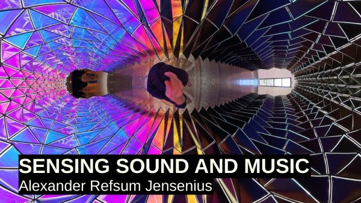

# Introduction

<figure style="float: right; margin-left: 20px;">
    
<!--    <figcaption>Book cover: Sensing Sound and Music</figcaption>-->
</figure>

This textbook is written for the course [MUS2640 Sensing Sound and Music](https://www.uio.no/studier/emner/hf/imv/MUS2640/) at the University of Oslo, a foundation course for later studies in *music psychology* and *music technology*. You will be introduced to fundamental principles of acoustics, psychoacoustics, and perception. This includes knowledge about how sound is produced in instruments, reflected in space, and perceived by humans. This is the basis for how we experience pitch, timbre, harmony, and rhythm in music. You will also learn about computer-based representations of sound and music, and get an overview of digital audio, sound synthesis, and analysis. The course provides theoretical knowledge and practical skills for further studies of music psychology and technology.

:::{important} Learning Outcome
Having completed the course, you will:

- be familiar with principles of how musical sound is produced and perceived.
- understand relationships between sound-theoretical and music-theoretical concepts.
- be able to process, synthesize, and analyze sound.
:::


## Pedagogical Strategy

Students in the course typically have mixed backgrounds. Everyone usually has some kind of musical background, ranging from classical performance on acoustic instruments to electronic studio production. Some come from psychology, others from computer science, and others again from media studies, philosophy, linguistics, medicine, and more. Everyone is welcome! In-class activities will be adjusted to cater to the collective knowledge and experience of the student group. 

### Active learning and "flipped classroom"

This course builds on the idea of *active learning*, an approach that emphasizes student engagement and participation in the learning process. Rather than passively receiving information through lectures, students are encouraged to interact with the material, ask questions, solve problems, and collaborate with peers. Activities may include group discussions, hands-on experiments, peer reviewing, and real-world projects. This method helps deepen understanding, improve retention, and develop critical thinking skills.

We also rely on a *flipped classroom** approach, which is a teaching model where traditional lecture content is delivered outside of class, typically through readings, videos, or interactive resources. This frees up classroom time to applying concepts through discussion, exercises, and collaborative work. This structure allows students to learn foundational material at their own pace and use class sessions for deeper exploration, clarification, and practical application. The flipped classroom fosters a more personalized and interactive learning environment, supporting diverse learning styles and encouraging active participation.

### A research-based and research-led course

This is a *research-based* course, which means that the content builds on new research results. All the teachers are active researchers and will bring in perspectives from ongoing projects. Much of this is based on scientific methods, but given the nature of the subject, we also include research that is design-centered or based in artistic practice. We will dwell on these differences at times, since understanding the different epistemological foundations for our knowledge production is important. 

The course is also *research-led*, meaning that students will take part in ongoing research. This makes it possible for students to see how "real" research is conducted in practice. It is also valuable for the ongoing projects in the department. Although it is not required, you are encouraged to participate in research activities, contributing to ongoing projects or initiating new ones. This hands-on involvement helps bridge the gap between learning and research, fostering a culture of inquiry and innovation.

### Open Education

The course material is developed from the perspective of Open Education, meaning that everything is freely and openly available. This approach ensures that students have unrestricted access to resources, enabling them to revisit and explore the material beyond the course duration. Open Education also promotes collaboration and sharing of knowledge within and outside the academic community. This is important for societal innovation and the legitimization of ongoing research. 

Open Education aligns closely with the principles of Open Research, which emphasize transparency, accessibility, and reproducibility. In this course, we aim to integrate these principles by providing access to:

- **Open Publications**: Most of the required reading materials will be openly available, either entirely free ("free as in speech") or through institutional agreements ("free as in beer"). This means that there should be no economic barrier to attaining relevant knowledge. 

- **Open Data**: Wherever possible, datasets used in the course will be openly shared. This allows students to analyze, visualize, and interpret data independently, fostering a deeper understanding of the material and encouraging reproducibility in their work.

- **Open Source Code**: Tools, scripts, and examples provided during the course will be shared as open-source code. This enables students to study, modify, and build upon the code, promoting a hands-on approach to learning and encouraging contributions to the broader community.

By adopting these practices, the course not only supports students in their academic journey but also contributes to the global movement toward open and equitable access to knowledge. This approach empowers students to become active participants in the creation and dissemination of knowledge, preparing them for future roles as researchers, educators, and innovators.

### Embracing AI

In this course, we will actively explore the use of *artificial intelligence* both for exploring the content of the course but also as a pedagogical tool. There are currently many available AI tools, yet they are underexploited. We will try different tools and evaluate their effectiveness. 

This textbook is an example of AI-based *co-creation*. Sections of the text are partly&mdash;or even fully&mdash;written by large language models. However, everything has been going through a human "peer review" to ensure that everything is in order. Throughout the course, we will explore when AI can safely be used for text generation and when it fails. 

As an educator, using AI tools can help streamline administrative tasks and speed up content creation, which frees up time for meaningful interactions with students. It can help identify patterns in student performance, enabling targeted support and early intervention. AI-driven analytics offer insights into class engagement and learning outcomes, supporting data-informed teaching strategies.

Students should also use AI actively. AI-powered platforms can adapt content and feedback to individual learning styles and paces, helping students master concepts more effectively. However, AI-based tools should be used wisely; they are there to help learning, not to replace it. After all, the exam will be performed without any tools. Then you will need to think and write on your own!


## Tools

We will explore various tools throughout the semester. You will not learn any of these in detail, but you will see how they work and understand their applications. These tools are designed to provide a broad overview of the possibilities in music technology and sound analysis:

<details>
<summary>Software</summary>

- **[Sonic Visualiser](https://www.sonicvisualiser.org/)**: A powerful application for viewing and analyzing the contents of audio files. It allows you to visualize waveforms, spectrograms, and other audio features, making it a valuable tool for music analysis and research.

- **[Python - Jupyter Notebook](https://jupyter.org/)**: An open-source web application that enables you to create and share documents containing live code, equations, visualizations, and narrative text. It is widely used for data analysis, including audio and music data.

- **[Pure Data (Pd)](https://puredata.info/)**: An open-source visual programming language for audio and multimedia. It is widely used for sound synthesis, audio processing, and interactive installations.

- **[Max](https://cycling74.com/products/max)**: A visual programming environment for music and multimedia. It allows you to create custom audio and visual applications, making it a versatile tool for creative projects.

- **[Audiostellar](https://audiostellar.xyz/)**: A unique tool for exploring and organizing sound samples using a visual interface. It helps you discover relationships between sounds and create new compositions.
</details>

<details>
<summary>Mobile phone apps</summary>

- **[Noise Capture](https://noise-planet.org/noisecapture.html)**: A mobile app for recording and analyzing environmental noise. It is useful for studying soundscapes and understanding the impact of noise in different environments.
</details>

- **[Freesound](https://freesound.org/)**: A collaborative online database of sound samples. It provides access to a wide variety of sounds that can be used for music production, sound design, and research.

<details>
<summary>Hardware</summary>

- **[LittleBits](https://littlebits.com/)**: A platform of modular electronic components that snap together to create interactive projects. It is a fun and creative way to explore sound synthesis and music-making.

- **[Ambisonics - Zoom H3-VR](https://zoomcorp.com/en/us/handheld-recorders/handheld-recorders/h3-vr-handy-recorder/)**: A portable recorder designed for capturing 360-degree spatial audio. It is ideal for creating immersive soundscapes and exploring 3D audio reproduction.

- **[OptiTrack Motion Capture](https://optitrack.com/)**: A high-precision motion capture system used for tracking movement in 3D space. It is widely used in research, gaming, and performance arts to analyze and visualize motion, including applications in music and sound interaction.

- **[Equivital Life Monitors](https://www.equivital.com/)**: Wearable devices designed to monitor physiological data such as heart rate, respiration, and body temperature. These devices are useful for studying the relationship between physiological responses and musical experiences.
</details>


## Curriculum

The current textbook comprises the core curriculum for this course. The following sections list relevant supplementary literature. 

<details>
<summary>Some relevant books</summary>

- **[Music Psychology: A Very Short Introduction](https://global.oup.com/academic/product/music-psychology-a-very-short-introduction-9780198722944)**: *Elizabeth Hellmuth Margulis* (2018), Oxford: Oxford University Press. A concise introduction to the field of music psychology, exploring how music affects the mind and behavior.

- **[Music and Technology: A Very Short Introduction](https://global.oup.com/academic/product/music-and-technology-a-very-short-introduction-9780198723910)**: *Mark Katz* (2014), Oxford: Oxford University Press. An accessible overview of the relationship between music and technology, examining its impact on creation, performance, and listening.

- **[Auditory Interfaces](https://www.routledge.com/Auditory-Interfaces/Serafin/p/book/9780367332327)**: *Stefania Serafin* (2023), London/New York: Routledge. A comprehensive exploration of auditory interfaces, focusing on their design, implementation, and applications in interactive systems.

- **[Sound Actions: Conceptualizing Musical Instruments](https://mitpress.mit.edu/9780262047025/sound-actions/)**: *Alexander Refsum Jensenius* (2022), Cambridge: The MIT Press. An insightful examination of musical instruments as tools for interaction, creativity, and expression.

- **[Music and the Mind: Foundations of Cognitive Musicology](https://global.oup.com/academic/product/music-and-the-mind-9780198869175)**: *Tuomas Eerola* (2021), Oxford: Oxford University Press. A foundational text offering a deep dive into the cognitive processes underlying music perception and cognition.

- **[Designing Sound](https://mitpress.mit.edu/9780262014416/designing-sound/)**: *Andy Farnell* (2010), Cambridge: The MIT Press. A practical guide to sound design, offering insights into creating and manipulating sound for various applications.

- **[Music and Memory: An Introduction](https://mitpress.mit.edu/9780262692379/music-and-memory/)**: *Bob Snyder* (2000), Cambridge: The MIT Press. An exploration of how music interacts with memory, providing insights into the cognitive processes involved.

- **[Ways of Listening: An Ecological Approach to the Perception of Musical Meaning](https://global.oup.com/academic/product/ways-of-listening-9780195151945)**: *Eric F. Clarke* (2005), Oxford: Oxford University Press. A unique perspective on how listeners perceive and interpret musical meaning in ecological contexts.

- **[Real Sound Synthesis for Interactive Applications](https://www.amazon.com/Real-Sound-Synthesis-Interactive-Applications/dp/1568811683)**: *Perry R. Cook* (2002), Natick: A K Peters. A resource for exploring advanced topics in sound synthesis and interactive applications.

- **[The Psychology of Music](https://www.elsevier.com/books/the-psychology-of-music/deutsch/978-0-12-381460-9)**: *Diana Deutsch* (1999), New York: Academic Press. A foundational text on the psychological aspects of music perception and cognition.

- **[Auditory Scene Analysis: The Perceptual Organization of Sound](https://mitpress.mit.edu/9780262521952/auditory-scene-analysis/)**: *Albert S. Bregman* (1990), Cambridge: The MIT Press. A seminal work on how humans organize and interpret complex auditory environments.

- **[Musical Acoustics](https://www.cengage.com/c/musical-acoustics-3e-hall/9780534377281/)**: *Donald E. Hall* (1991), Pacific Grove: Brooks/Cole Publishing. A detailed introduction to the acoustics of musical instruments and sound production.

- **[The Soundscape: Our Sonic Environment and the Tuning of the World](https://www.innertraditions.com/books/the-soundscape)**: *R. Murray Schafer* (1994), Rochester: Destiny Books. A pioneering exploration of soundscapes and their impact on human perception and culture.
</details>

Some books serve more as large-scale references of their respective fields: 

- **[The Computer Music Tutorial](https://www.amazon.com/Computer-Music-Tutorial-Curtis-Roads/dp/0262680823)**: *Curtis Roads* (1996), Cambridge: The MIT Press. A definitive guide to the principles and practices of computer music, covering both theory and application.

- **[Handbook of Systematic Musicology](https://www.springer.com/gp/book/9783030175667)**: *Edited by multiple authors* (2020), Springer. A detailed reference for interdisciplinary approaches to the study of musicology.

- **[The Oxford Handbook of Music Psychology](https://global.oup.com/academic/product/the-oxford-handbook-of-music-psychology-9780198818838)**: Edited by *Susan Hallam, Michael Thaut, Ian Cross* (2018), Oxford: Oxford University Press. A comprehensive overview of research and theories in music psychology.

There are not many relevant books in Norwegian, but here are some: 

<details>
<summary>Relevant Norwegian-language books</summary>

- **[Musikk og Bevegelse](https://www.duo.uio.no/handle/10852/25589)**: *Alexander Refsum Jensenius* (2009), Oslo: Unipub. A Norwegian book exploring the relationship between music and movement.

- **[Lydlandskap: Om Bruk og Misbruk av Musikk](https://www.fagbokforlaget.no/Lydlandskap/I9788245002718)**: *Even Ruud* (2005), Bergen: Fagbokforlaget. A Norwegian book discussing the use and misuse of music in various contexts.
</details>


<details>
<summary>Relevant articles</summary>

- **[Groove](https://global.oup.com/academic/product/groove-9780190943248)**  
    *Guilherme Schmidt Câmara, Anne Danielsen, Alexander Rehding, Steven Rings* (2020), Oxford: Oxford University Press.

- **[Musical Illusions and Phantom Words: How Music and Speech Unlock Mysteries of the Brain](https://global.oup.com/academic/product/musical-illusions-and-phantom-words-9780190206831)**  
    *Diana Deutsch* (2019), Oxford: Oxford University Press.

- **[Timing is Everything...Or Is It? Effects of Instructed Timing Style, Reference, and Pattern on Drum Kit Sound in Groove-Based Performance](https://online.ucpress.edu/mp/article/38/1/1/112548/Timing-is-Everything-Or-Is-It-Effects-of)**  
    *Guilherme Schmidt Câmara, Kristian Nymoen, Olivier Lartillot, Anne Danielsen* (2020), *Music Perception*, 38(1), pp. 1–26.

- **[R. Murray Schafer (1933–2021) and the World Soundscape Project](https://www.cambridge.org/core/journals/organised-sound/article/r-murray-schafer-19332021-and-the-world-soundscape-project/)**  
    *Barry Truax* (2021), *Organised Sound*, 26(3), pp. 419–421.

- **[Artist's Note: The Earth Worm Also Sings - A Composer's Practice of Deep Listening](https://www.jstor.org/stable/pdf/1513267.pdf)**  
    *Pauline Oliveros* (1993), *Leonardo Music Journal*, 3, pp. 35–38.

- **[Pauline Oliveros: A Shared Resonance](https://www.cambridge.org/core/journals/organised-sound/article/pauline-oliveros-a-shared-resonance/)**  
    *Ximena Alarcón, Ron Herrema* (2017), *Organised Sound*, 22(1), pp. 7–10.

- **[SOUNDWORK: The Natural Complexities of Environmental Listening: One Soundwalk - Multiple Responses](https://ojs.library.ubc.ca/index.php/bcstudies/article/view/194)**  
    *Hildegard Westerkamp* (2017), *BC Studies*, (194), pp. 149–.
</details>


## Overview

```{tableofcontents}
```

## Learn more

::::{grid} 1 1 2 2
:::{card} MUS2133 Music Psychology
:link: https://www.uio.no/studier/emner/hf/imv/mus2133/
This course explores the psychological aspects of music perception and cognition, including auditory perception, emotional responses to music, and the cognitive processes involved in musical activities such as listening, performing, and composing.
:::

:::{card} MUS2830 Computer Music
:link: https://www.uio.no/studier/emner/hf/imv/MUS2830/
This course delves into the intersection of music and technology, covering topics such as sound synthesis, digital audio processing, and algorithmic composition. Gain hands-on experience with tools and techniques used in creating and analyzing music through computational methods.
:::

:::
::::
