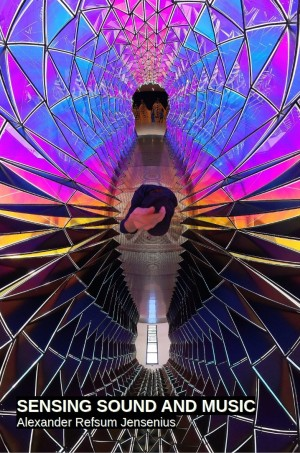

# Introduction

<figure style="float: right; margin-left: 20px;">
    
    <figcaption>Book cover: Sensing Sound and Music</figcaption>
</figure>

This textbook is written for the course [MUS2640 Sensing Sound and Music](https://www.uio.no/studier/emner/hf/imv/MUS2640/) at the University of Oslo. It is the foundation course for the study fields *music psychology* and *music technology*. Students are encouraged to take the following courses next [MUS2133 Music Psychology](https://www.uio.no/studier/emner/hf/imv/mus2133/) and [MUS2830 Computer Music](https://www.uio.no/studier/emner/hf/imv/MUS2830/). 

## Course Content

You will be introduced to fundamental principles of acoustics, psychoacoustics, and perception. This includes knowledge about how sound is produced in instruments, reflected in space, and perceived by humans. This is the foundation for how we experience pitch, timbre, harmony, and rhythm in music. You will also learn about computer-based representations of sound and music, and get an overview of digital audio, sound synthesis, and analysis. The course provides theoretical knowledge and practical skills for further studies of music psychology and technology.

## Learning Outcome

Having completed the course, you will:

- Be familiar with principles of how musical sound is produced and perceived.
- Understand relationships between sound-theoretical and music-theoretical concepts.
- Be able to process, synthesize, and analyze sound.

## Pedagogical Strategy

You should not expect traditional lectures. Instead, we will explore (musical) sound and music together through hands-on activities, discussions, and collaborative projects. The course emphasizes active participation and experiential learning, encouraging students to engage with the material in creative and critical ways. By working together, we aim to foster a deeper understanding of the subject matter and its applications.

## Open Education

The course material is developed from the perspective of Open Education, meaning that everything is freely and openly available. This approach ensures that students have unrestricted access to resources, enabling them to revisit and explore the material beyond the course duration. Open Education also promotes collaboration and sharing of knowledge within and outside the academic community.

Open Education aligns closely with the principles of Open Research, which emphasize transparency, accessibility, and reproducibility. In this course, we aim to integrate these principles by providing access to:

- **Open Data**: Wherever possible, datasets used in the course will be openly shared. This allows students to analyze, visualize, and interpret data independently, fostering a deeper understanding of the material and encouraging reproducibility in their work.

- **Open Source Code**: Tools, scripts, and examples provided during the course will be shared as open-source code. This enables students to study, modify, and build upon the code, promoting a hands-on approach to learning and encouraging contributions to the broader community.

- **Open Educational Resources (OER)**: All course materials, including lecture notes, assignments, and project guidelines, will be openly licensed. This ensures that students and educators worldwide can access and adapt the content for their own purposes.

- **Collaborative Research Opportunities**: Students will be encouraged to participate in research activities, contributing to ongoing projects or initiating their own. This hands-on involvement helps bridge the gap between learning and research, fostering a culture of inquiry and innovation.

By adopting these practices, the course not only supports students in their academic journey but also contributes to the global movement toward open and equitable access to knowledge. This approach empowers students to become active participants in the creation and dissemination of knowledge, preparing them for future roles as researchers, educators, and innovators.

## Psychology + Technology

By the end of the course, you will have learned some of the basic terminology, theories, and methods used in music psychology and music technology. This includes understanding how psychological principles apply to music perception and cognition, as well as how technological tools can be used to analyze and create music. The integration of these fields provides a holistic perspective on the study of sound and music.

### Venn Diagram: Musicology, Psychology, and Technology

Below is a conceptual illustration of the intersection between musicology, psychology, and technology. This Venn diagram highlights the unique and overlapping areas of these fields:

```{mermaid}
%%{init: {"flowchart": {"htmlLabels": false}} }%%
flowchart LR
    markdown["`This **is** _Markdown_`"]
    newLines["`Line1
    Line 2
    Line 3`"]
    markdown --> newLines
```

<figure>
  <svg width="300" height="300" xmlns="http://www.w3.org/2000/svg">
    <!-- Circle 1 -->
    <circle cx="100" cy="150" r="80" fill="red" fill-opacity="0.5" />
    <!-- Circle 2 -->
    <circle cx="200" cy="150" r="80" fill="blue" fill-opacity="0.5" />
    <!-- Circle 3 -->
    <circle cx="150" cy="80" r="80" fill="green" fill-opacity="0.5" />
    <!-- Labels -->
    <text x="60" y="150" font-size="12" fill="black">Musicology</text>
    <text x="210" y="150" font-size="12" fill="black">Technology</text>
    <text x="140" y="50" font-size="12" fill="black">Psychology</text>
  </svg>
</figure>

#### Key Areas:
- **Musicology**: Study of music's history, theory, and cultural context.
- **Psychology**: Exploration of human perception, cognition, and behavior.
- **Technology**: Tools and methods for creating, analyzing, and manipulating sound.
- **Music Psychology**: How humans perceive and respond to music.
- **Music Technology**: Use of technology in music creation and analysis.
- **Psychological Technology**: Tools for studying human responses to sound and music.
- **Interdisciplinary Studies**: Integration of all three fields for a holistic understanding of sound and music.

### Basics of Psychology in Music

Psychology in music focuses on understanding how humans perceive, process, and respond to sound and music. This includes exploring topics such as:

- **Perception**: How the brain interprets sound waves as musical elements like pitch, rhythm, and timbre.
- **Cognition**: The mental processes involved in understanding and remembering music, including pattern recognition and emotional responses.
- **Behavior**: How music influences actions, such as movement, performance, and social interaction.
- **Emotion**: The study of how music evokes feelings and moods, and its role in emotional regulation and expression.

These principles help us understand the universal and individual ways in which music impacts human experience, providing insights into both the psychological and cultural dimensions of music.

### Basics of Technology in Music

Technology in music involves the use of tools and systems to create, analyze, and manipulate sound. Key areas include:

- **Sound Synthesis**: Generating sound electronically using techniques like additive, subtractive, and granular synthesis.
- **Digital Audio Processing**: Editing and transforming sound using software tools for tasks such as filtering, equalization, and effects.
- **Music Information Retrieval (MIR)**: Extracting meaningful information from audio data, such as tempo, key, and genre classification.
- **Interactive Systems**: Designing systems that respond to user input, enabling real-time music creation and performance.

These technologies expand the possibilities for music creation and analysis, offering new ways to explore and innovate within the field.

## Tools

We will explore various tools throughout the semester. You will not learn any of these in detail, but you will be exposed to various tools that you may explore further on your own. These tools are designed to provide a broad overview of the possibilities in music technology and sound analysis:

- **[Sonic Visualiser](https://www.sonicvisualiser.org/)**: A powerful application for viewing and analyzing the contents of audio files. It allows you to visualize waveforms, spectrograms, and other audio features, making it a valuable tool for music analysis and research.

- **[Python - Jupyter Notebook](https://jupyter.org/)**: An open-source web application that enables you to create and share documents containing live code, equations, visualizations, and narrative text. It is widely used for data analysis, including audio and music data.

- **[Freesound](https://freesound.org/)**: A collaborative online database of sound samples. It provides access to a wide variety of sounds that can be used for music production, sound design, and research.

- **[Glicol](https://glicol.org/)**: A live coding environment for sound synthesis and algorithmic composition. It is designed to be beginner-friendly while offering powerful capabilities for creating music programmatically.

- **[WAXML](https://www.waxml.org/)**: A framework for creating interactive audio experiences using web technologies. It simplifies the process of building audio applications for the web.

- **[P5.js](https://p5js.org/)**: A JavaScript library for creative coding, with a focus on making coding accessible and inclusive. It is often used for creating visual and audio-based interactive projects.

- **[Pure Data (Pd)](https://puredata.info/)**: An open-source visual programming language for audio and multimedia. It is widely used for sound synthesis, audio processing, and interactive installations.

- **[Max](https://cycling74.com/products/max)**: A visual programming environment for music and multimedia. It allows you to create custom audio and visual applications, making it a versatile tool for creative projects.

- **[Audiostellar](https://audiostellar.xyz/)**: A unique tool for exploring and organizing sound samples using a visual interface. It helps you discover relationships between sounds and create new compositions.

- **[Noise Capture](https://noise-planet.org/noisecapture.html)**: A mobile app for recording and analyzing environmental noise. It is useful for studying soundscapes and understanding the impact of noise in different environments.

We will also explore some relevant hardware devices: 

- **[LittleBits](https://littlebits.com/)**: A platform of modular electronic components that snap together to create interactive projects. It is a fun and creative way to explore sound synthesis and music-making.

- **[Ambisonics - Zoom H3-VR](https://zoomcorp.com/en/us/handheld-recorders/handheld-recorders/h3-vr-handy-recorder/)**: A portable recorder designed for capturing 360-degree spatial audio. It is ideal for creating immersive soundscapes and exploring 3D audio reproduction.

- **[OptiTrack Motion Capture](https://optitrack.com/)**: A high-precision motion capture system used for tracking movement in 3D space. It is widely used in research, gaming, and performance arts to analyze and visualize motion, including applications in music and sound interaction.

- **[Equivital Life Monitors](https://www.equivital.com/)**: Wearable devices designed to monitor physiological data such as heart rate, respiration, and body temperature. These devices are useful for studying the relationship between physiological responses and musical experiences.

## Curriculum

The current textbook comprises the core curriculum for this course. The following sections list relevant supplementary literature. 

### Books

- **[Auditory Interfaces](https://www.routledge.com/Auditory-Interfaces/Serafin/p/book/9780367332327)**: *Stefania Serafin* (2023), London/New York: Routledge. A comprehensive exploration of auditory interfaces, focusing on their design, implementation, and applications in interactive systems.

- **[Sound Actions: Conceptualizing Musical Instruments](https://mitpress.mit.edu/9780262047025/sound-actions/)**: *Alexander Refsum Jensenius* (2022), Cambridge: The MIT Press. An insightful examination of musical instruments as tools for interaction, creativity, and expression.

- **[Music and the Mind: Foundations of Cognitive Musicology](https://global.oup.com/academic/product/music-and-the-mind-9780198869175)**: *Tuomas Eerola* (2021), Oxford: Oxford University Press. A foundational text offering a deep dive into the cognitive processes underlying music perception and cognition.

- **[Designing Sound](https://mitpress.mit.edu/9780262014416/designing-sound/)**: *Andy Farnell* (2010), Cambridge: The MIT Press. A practical guide to sound design, offering insights into creating and manipulating sound for various applications.

- **[Music and Memory: An Introduction](https://mitpress.mit.edu/9780262692379/music-and-memory/)**: *Bob Snyder* (2000), Cambridge: The MIT Press. An exploration of how music interacts with memory, providing insights into the cognitive processes involved.

- **[Ways of Listening: An Ecological Approach to the Perception of Musical Meaning](https://global.oup.com/academic/product/ways-of-listening-9780195151945)**: *Eric F. Clarke* (2005), Oxford: Oxford University Press. A unique perspective on how listeners perceive and interpret musical meaning in ecological contexts.

- **[Real Sound Synthesis for Interactive Applications](https://www.amazon.com/Real-Sound-Synthesis-Interactive-Applications/dp/1568811683)**: *Perry R. Cook* (2002), Natick: A K Peters. A resource for exploring advanced topics in sound synthesis and interactive applications.

- **[The Psychology of Music](https://www.elsevier.com/books/the-psychology-of-music/deutsch/978-0-12-381460-9)**: *Diana Deutsch* (1999), New York: Academic Press. A foundational text on the psychological aspects of music perception and cognition.

- **[Auditory Scene Analysis: The Perceptual Organization of Sound](https://mitpress.mit.edu/9780262521952/auditory-scene-analysis/)**: *Albert S. Bregman* (1990), Cambridge: The MIT Press. A seminal work on how humans organize and interpret complex auditory environments.

- **[Musical Acoustics](https://www.cengage.com/c/musical-acoustics-3e-hall/9780534377281/)**: *Donald E. Hall* (1991), Pacific Grove: Brooks/Cole Publishing. A detailed introduction to the acoustics of musical instruments and sound production.

- **[The Soundscape: Our Sonic Environment and the Tuning of the World](https://www.innertraditions.com/books/the-soundscape)**: *R. Murray Schafer* (1994), Rochester: Destiny Books. A pioneering exploration of soundscapes and their impact on human perception and culture.

There are some books that serve more as large-scale references of their respective fields: 

- **[The Computer Music Tutorial](https://www.amazon.com/Computer-Music-Tutorial-Curtis-Roads/dp/0262680823)**: *Curtis Roads* (1996), Cambridge: The MIT Press. A definitive guide to the principles and practices of computer music, covering both theory and application.

- **[Handbook of Systematic Musicology](https://www.springer.com/gp/book/9783030175667)**: *Edited by multiple authors* (2020), Springer. A detailed reference for interdisciplinary approaches to the study of musicology.

- **[The Oxford Handbook of Music Psychology](https://global.oup.com/academic/product/the-oxford-handbook-of-music-psychology-9780198818838)**: Edited by *Susan Hallam, Michael Thaut, Ian Cross* (2018), Oxford: Oxford University Press. A comprehensive overview of research and theories in music psychology.


There are not many relevant books in Norwegian, but here are some: 

- **[Musikk og Bevegelse](https://www.duo.uio.no/handle/10852/25589)**: *Alexander Refsum Jensenius* (2009), Oslo: Unipub. A Norwegian book exploring the relationship between music and movement.

- **[Lydlandskap: Om Bruk og Misbruk av Musikk](https://www.fagbokforlaget.no/Lydlandskap/I9788245002718)**: *Even Ruud* (2005), Bergen: Fagbokforlaget. A Norwegian book discussing the use and misuse of music in various contexts.


### Articles

- **[Groove](https://global.oup.com/academic/product/groove-9780190943248)**  
    *Guilherme Schmidt Câmara, Anne Danielsen, Alexander Rehding, Steven Rings* (2020), Oxford: Oxford University Press.

- **[Musical Illusions and Phantom Words: How Music and Speech Unlock Mysteries of the Brain](https://global.oup.com/academic/product/musical-illusions-and-phantom-words-9780190206831)**  
    *Diana Deutsch* (2019), Oxford: Oxford University Press.

- **[Timing is Everything...Or Is It? Effects of Instructed Timing Style, Reference, and Pattern on Drum Kit Sound in Groove-Based Performance](https://online.ucpress.edu/mp/article/38/1/1/112548/Timing-is-Everything-Or-Is-It-Effects-of)**  
    *Guilherme Schmidt Câmara, Kristian Nymoen, Olivier Lartillot, Anne Danielsen* (2020), *Music Perception*, 38(1), pp. 1–26.

- **[R. Murray Schafer (1933–2021) and the World Soundscape Project](https://www.cambridge.org/core/journals/organised-sound/article/r-murray-schafer-19332021-and-the-world-soundscape-project/)**  
    *Barry Truax* (2021), *Organised Sound*, 26(3), pp. 419–421.

- **[Artist's Note: The Earth Worm Also Sings - A Composer's Practice of Deep Listening](https://www.mitpressjournals.org/doi/10.1162/lmj.1993.3.1.35)**  
    *Pauline Oliveros* (1993), *Leonardo Music Journal*, 3, pp. 35–38.

- **[Pauline Oliveros: A Shared Resonance](https://www.cambridge.org/core/journals/organised-sound/article/pauline-oliveros-a-shared-resonance/)**  
    *Ximena Alarcón, Ron Herrema* (2017), *Organised Sound*, 22(1), pp. 7–10.

- **[SOUNDWORK: The Natural Complexities of Environmental Listening: One Soundwalk - Multiple Responses](https://ojs.library.ubc.ca/index.php/bcstudies/article/view/194)**  
    *Hildegard Westerkamp* (2017), *BC Studies*, (194), pp. 149–.

### Videos
- **[Ideas Roadshow: Believing Your Ears - Auditory Illusions](https://ideasroadshow.com/items/believing-your-ears-auditory-illusions)**  
    *Diana Deutsch in conversation with Howard Burton* (2015), Open Agenda Publishing.

This list provides a mix of foundational texts, recent research, and multimedia resources to deepen your understanding of the topics covered in the course.


## Overview

```{tableofcontents}
```
