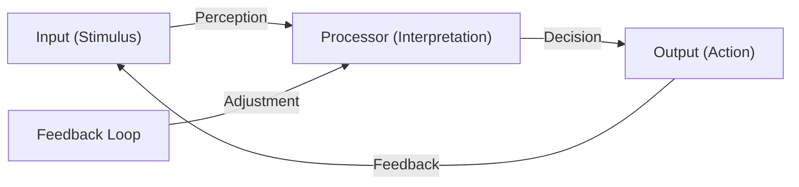

## Describing sounds

Recall last week's discussion about hearing and listening. We will get back to the mechanisms for hearing in the coming weeks&mdash;both the acoustics and psychoacoustics part of the matter&mdash;but this week will focus on how we listen and what we listen to. 

```{exercise} Listen when standing
1. Find a suitable location.
2. Stand still for two minutes with your eyes closed.
3. Listen attentively to the environment.
4. Open your eyes and stand still for another two minutes.
5. Listen attentively to the environment.
6. Write down some reflections about what you heard. Did it change after opening the eyes?
```

### Many approaches to describing sounds

Academic approaches to describing sounds and soundscapes vary across the main disciplines of musicology, psychology, and technology, but there are also various subfields, each offering distinct frameworks and terminology:

- **Acoustics**: Focuses on the physical properties of sound waves, such as frequency, amplitude, duration, and propagation in different media.  
	*Example*: An acoustician might describe a clap in a concert hall as "a broadband impulse with a peak amplitude of 85 dB SPL, followed by a reverberation decay time of 1.8 seconds," using measurements and graphs to illustrate how sound behaves in the space.

- **Psychoacoustics**: Investigates how humans perceive sound, using quantitative measures (frequency, loudness, spatial location) and perceptual attributes (brightness, roughness).  
	*Example*: A psychoacoustic study might report that "a 1000 Hz tone at 60 dB SPL is perceived as moderately loud and bright," and compare listener responses to tones with varying roughness or spatial placement.

- **Music theory**: Focus on musical parameters (pitch, rhythm, timbre, dynamics) and cultural context.  
	*Example*: A musicologist might describe a violin note as "a sustained, high-pitched tone with a bright timbre and gradual crescendo," using musical notation or a spectrogram to illustrate its frequency and amplitude over time.

- **Spectromorphology**: This specialized form of music theory analyzes the spectral (frequency) and morphological (shape, evolution) characteristics of sounds.  
	*Example*: A spectromorphological analysis could describe a cymbal crash as "an impulsive onset followed by a complex, evolving spectrum that decays over several seconds," visualized with a spectrogram showing frequency content over time.

All of these descriptions focus specifically on describing the sound "itself" or how we *hear* it. There are also several approaches to studying the effects of sound on people or environments: 

- **Sound Studies**: An interdisciplinary field that examines sound as a cultural, social, and material phenomenon. Sound studies draw from media studies, anthropology, history, and philosophy to explore how sound shapes and is shaped by society, technology, and everyday life.  
	*Example*: A sound studies scholar might analyze how urban noise regulations reflect social attitudes toward public space, or investigate the role of sound in shaping collective memory and identity.

- **Acoustic Ecology**: Emphasizes environmental context, categorizing sounds as keynote, signal, or soundmark (Schafer). Soundscapes are described in terms of their ecological function and impact.  
	*Example*: An acoustic ecologist could document a city park by noting "birdsong as a keynote, a distant siren as a signal, and the hourly chime of a church bell as a soundmark," analyzing how each sound shapes the experience of the space.

- **Ethnography and Anthropology**: Uses qualitative methods such as interviews, field notes, and participatory observation to describe how communities interact with and interpret their sonic environments.  
	*Example*: An ethnographer might record that "local residents describe the evening call to prayer as calming and unifying," supplementing this with field notes and interviews about its social significance.

- **Linguistics and Semiotics**: Examines the meaning and communicative function of sounds, including onomatopoeia, prosody, and sound symbolism.  
	*Example*: A linguist could analyze the word "buzz" as onomatopoeic, noting how its sound mimics the noise of a bee, or study how rising intonation in speech signals a question.

There is no right or wrong when it combines to studying sound. All of these approaches (and more) aim to uncover various aspects of both the physical properties of sounds but also their meaning, context, and impact on listeners. We won't have time to cover all of these in detail in this course, but will look more closely at some of the closest ones to the fields of music psychology and technology.


## Soundscapes

A *soundscape* refers to the acoustic environment as perceived or experienced by people, encompassing all the sounds that arise from both natural and human-made sources. Describing soundscapes involves several dimensions:

- **Physical Properties**: Documenting the types of sounds present (e.g., birdsong, traffic, water), their frequency ranges, loudness, and temporal patterns.
- **Ecological Function**: Identifying the roles sounds play in the environment, such as signaling, masking, or providing information about ecological health.
- **Spatial Characteristics**: Noting how sounds are distributed in space—directionality, distance, and reverberation within the environment.
- **Cultural and Social Context**: Considering how people interpret, value, or interact with the sounds in their environment, including historical or cultural associations.
- **Perceptual Attributes**: Describing how listeners experience the soundscape—pleasantness, annoyance, tranquility, or stimulation.
- **Documentation Methods**: Using field recordings, annotated sound maps, spectrograms, and written descriptions to capture and analyze soundscapes.

A comprehensive description of a soundscape often combines objective measurements (such as decibel levels and frequency analysis) with subjective impressions and contextual information, providing a holistic understanding of the sonic environment.


### R. Murray Schafer and Acoustic Ecology
[R. Murray Schafer](https://en.wikipedia.org/wiki/R._Murray_Schafer) (1933–2021) was a pioneer of the [World Soundscape Project](https://en.wikipedia.org/wiki/World_Soundscape_Project). He introduced key concepts such as:
- **[Soundscape](https://en.wikipedia.org/wiki/Soundscape)**: The acoustic environment as perceived by humans.
- **[Schizophonia](https://en.wikipedia.org/wiki/Schizophonia)**: The separation of a sound from its source, often through recording technology.
- **Composed environments**: The intentional design of soundscapes.

Schafer inspired the [World Forum for Acoustic Ecology (WFAE) Conference](https://www.wfae.net/), an international gathering bringing together researchers, artists, educators, and practitioners to explore the relationship between humans and their sonic environments.


### Hildegard Westerkamp and Soundwalking
[Hildegard Westerkamp](https://en.wikipedia.org/wiki/Hildegard_Westerkamp) (1946–) advocated for [soundwalking](https://en.wikipedia.org/wiki/Soundwalking), a reflective practice of walking and listening to the environment. Her work was influenced by Schafer and the World Soundscape Project. 

Soundwalking is not only a practice of listening but also a method of engaging with the environment in a mindful and reflective way. It encourages participants to become aware of the acoustic ecology of their surroundings, fostering a deeper connection to place and community. Soundwalking can be used as a tool for artistic inspiration, environmental awareness, and even therapeutic purposes. 

Key aspects of soundwalking include:
- **Active Listening**: Paying close attention to the layers of sound in the environment, from the most prominent to the subtle.
- **Contextual Awareness**: Understanding how sounds interact with the physical and social context of a space.
- **Documentation**: Participants may choose to record sounds, take notes, or create maps to capture their auditory experience.

Soundwalking has been incorporated into various disciplines, including music, urban studies, and environmental science, as a way to explore the relationship between humans and their sonic environments.


```{exercise} Sound Walking
1. Walk slowly in a group, without talking 
2. Stop whenever you hear something interesting 
3. Write a note on why you stopped and what was interesting
```

- **[Ecoacoustics](https://en.wikipedia.org/wiki/Ecoacoustics)**: The study of ecological relationships through sound.
- **[Acoustic ecology](https://en.wikipedia.org/wiki/Acoustic_ecology)**: Examines the relationship between humans and their sonic environment.

```{exercise} Soundwalk
1. Walk slowly in a group, without talking.
2. Stop whenever you hear something interesting.
3. Write a note explaining why you stopped and what was interesting about the sound.
```
### Eric Clarke's Ecological Listening

[Eric Clarke](https://en.wikipedia.org/wiki/Eric_Clarke) explores the concept of **ecological listening**, which is grounded in **ecological perception theory**. This approach emphasizes:
- **Direct perception**: Listeners perceive sounds in relation to their environment without needing extensive cognitive processing.
- **Affordances**: Sounds provide cues about actions or interactions possible within a given environment.
- **Contextual listening**: The meaning of sounds is shaped by their environmental and situational context.

Clarke's work bridges psychology, musicology, and acoustic ecology, offering insights into how humans engage with sound as part of their lived experience.

## Sound objects

Pierre Schaeffer's approach to describing sound objects centers on the idea that sounds can be perceived as distinct, coherent units—*sound objects* (*objets sonores*). Rather than focusing on the source or meaning of a sound, Schaeffer advocated for *reduced listening*: attending to the intrinsic qualities of the sound itself, such as its texture, duration, pitch, and dynamics.

He developed a taxonomy for classifying sound objects based on their temporal and spectral characteristics. Three core types are:

- **Impulsive**: Short, percussive sounds (e.g., a click or a drum hit).
- **Sustained**: Continuous sounds with steady qualities (e.g., a drone or a held note).
- **Iterative**: Rapidly repeating sounds (e.g., a tremolo or a rattling noise).

Schaeffer's spectromorphological framework allows for detailed analysis of how sounds evolve over time and how their frequency content changes. This approach is foundational in electroacoustic music and sound design, providing tools to describe, compare, and manipulate sounds independently of their sources or cultural associations.


### Pierre Schaeffer and the Sound Object

The French composer and musicologist [Pierre Schaeffer](https://en.wikipedia.org/wiki/Pierre_Schaeffer) (1910–1995) is renowned for pioneering [musique concrète](https://en.wikipedia.org/wiki/Musique_concr%C3%A8te), a form of electroacoustic music that uses recorded sounds as raw material. Throughout his work, Schaeffer's work laid the foundation for modern sound design, electronic music, and auditory research, influencing generations of composers and sound theorists.

At the core of Schaeffer's thinking is the [sound object](https://en.wikipedia.org/wiki/Sound_object) (*l'objet sonore*), a coherent "chunk" of sound. His argument was that when listening to sound, we do not hear the continuous sound but that our perception is grouped into series of sound objects with specific properties. 

Further, Schaeffer introduced the idea of *reduced listening* as a way to focus on the intrinsic qualities of sound *itself* rather than its source (sound-producing objects and actions) or semantic meaning. This includes a sound's texture, tone, and dynamics. 

Schaeffer developed a *spectromorphology*, a large taxonomy for describing any type of sound object. 

Todo: add TARSOM

We will not get into the details of this, but it is worth noting the thre core sound types he introduced: impulsive, sustained, and iterative. 

Todo: add shapes

Schaeffer's thoughts have inspired numerous theorists and composers to date. In Norway, Schaeffer's thoughts have been moved forwards by Professor Rolf Inge Godøy (UiO) and Lasse Thoresen (NMH). 


### Michel Chion and AudioVisual theory

[Michel Chion](https://en.wikipedia.org/wiki/Michel_Chion) (1947–) expanded on Pierre Schaeffer's theories of listening by categorizing listening into three distinct modes:

- **Causal listening**: Inspired by Schaeffer's focus on sound sources, this mode involves identifying and understanding the origin of a sound.
- **Semantic listening**: Building on Schaeffer's exploration of sound's meaning, this mode interprets sounds as part of a language or code.
- **Reduced listening**: Directly derived from Schaeffer's concept, this mode emphasizes analyzing the intrinsic qualities of sound—its texture, tone, and dynamics—without considering its source or meaning.

Chion's framework refines Schaeffer's ideas, providing a structured approach to understanding how listeners engage with sound in various contexts.

Synchresis, a term coined by Michel Chion, refers to the perceptual phenomenon where a sound and a visual event are perceived as occurring simultaneously, even if they are artificially synchronized. This concept is central to audiovisual theory, as it highlights the human tendency to create a cohesive relationship between what is seen and heard. Synchresis plays a crucial role in film sound design, where it is used to enhance the emotional and narrative impact of scenes by aligning specific sounds with visual actions, regardless of their actual source or origin.


### Expanding Schaeffer’s thinking

Several theorists have built upon Pierre Schaeffer’s foundational ideas about sound objects and listening:

- **Dennis Smalley** (University of London) introduced and formalized the concept of *spectromorphology*, providing a comprehensive vocabulary for describing the spectral and morphological evolution of sounds. Smalley’s approach is widely used in electroacoustic music analysis and has helped clarify how listeners perceive the shape and transformation of sound objects over time.

- **Lasse Thoresen** (Norwegian Academy of Music) has expanded spectromorphological analysis, creating practical frameworks for describing and notating sound objects in both electroacoustic and acoustic music. Thoresen’s work bridges theory and practice, making Schaeffer’s taxonomy accessible for composers and analysts.

- **Rolf Inge Godøy** (University of Oslo) has advanced Schaeffer’s concepts by developing detailed models for how listeners perceive and mentally represent sound objects. Godøy’s work emphasizes *gestural-sonorous objects*, linking sound perception to physical gestures and movement, and has contributed to the field of *music cognition* and *morphological analysis*.


## Artistic explorations

This week, we will focus on some influential thinkers and practitioners from the 20th century that have contributed to our current understanding as a phenomenon. 

### John Cage and 4'33''

[John Cage](https://en.wikipedia.org/wiki/John_Cage) (1912–1992) was a groundbreaking American composer and music theorist whose work challenged traditional notions of music and sound. 

One of his most influential and controversial pieces is *[4'33''](https://en.wikipedia.org/wiki/4%E2%80%B233%E2%80%B3)*, composed in 1952. The piece consists of three movements, during which performers are instructed not to play their instruments. Instead, the focus shifts to the ambient sounds of the environment, making the audience's listening experience the central element of the composition. Cage's work emphasizes the idea that silence is never truly silent. The piece invites listeners to engage deeply with the sounds around them, blurring the line between music and environmental noise. *4'33''* is a seminal work in experimental music, influencing fields such as sound art, acoustic ecology, and contemporary composition.

Cage's philosophy of embracing chance and redefining music continues to inspire artists and thinkers across disciplines.

### Pauline Oliveros and Deep Listening
[Pauline Oliveros](https://en.wikipedia.org/wiki/Pauline_Oliveros) (1932–2016) created the [Deep Listening](https://en.wikipedia.org/wiki/Deep_Listening) practice, emphasizing:
- **Sonic awareness**: Heightened attention to sound and its context.
- The intersection of **[cybernetics](https://en.wikipedia.org/wiki/Cybernetics)** and the creative process.




### Other notable figures

Several authors have also written about critical and cultural perspectives:

- **[Theodor Adorno](https://en.wikipedia.org/wiki/Theodor_W._Adorno)**: Explored the critical theory of music and culture.
- **[Gilles Deleuze](https://en.wikipedia.org/wiki/Gilles_Deleuze)**: Analyzed cultural aspects of sound and listening.
- **[Julia Kristeva](https://en.wikipedia.org/wiki/Julia_Kristeva)**: Investigated the creative process in sound.

- **[Barry Truax](https://en.wikipedia.org/wiki/Barry_Truax)**: Explored synthesis and soundscape composition.


## Capturing sound

### Writing about sound

### Drawing sounds

### Recording sounds

Microphones

- **Types**:
  - [Dynamic microphones](https://en.wikipedia.org/wiki/Microphone#Dynamic_microphones).
  - [Condenser microphones](https://en.wikipedia.org/wiki/Microphone#Condenser_microphones).
- **Applications**:
  - Recording environmental sounds.
  - Enhancing listening practices.


## Microphones

- Microphones and listening - Krause 2016
- softhearers vs loudspeakers


```{exercise} Record soundscapes
1. Walk slowly in a group, without talking 
2. Stop whenever you hear something interesting 
3. Upload at least one sound to Freesound.org
```


## References

```{bibliography}
```
## Questions

1. What are the main differences between describing sounds in music theory, acoustic ecology, and psychoacoustics?
2. Explain Pierre Schaeffer's concept of the "sound object" and the practice of reduced listening.
3. How does Michel Chion's framework of causal, semantic, and reduced listening help us understand our engagement with sound?
4. What is the purpose of soundwalking, and how does it contribute to our understanding of acoustic ecology?
5. Describe the role of microphones in listening practices and soundscape documentation.