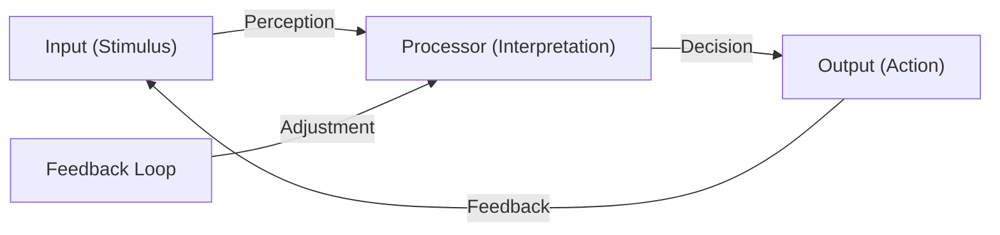

# Influential people and theories

This week, we will focus on some influential thinkers and practitioners from the 20th century that have contributed to our current understanding as a phenomenon. 

## Pierre Schaeffer and the Sound Object

The French composer and musicologist [Pierre Schaeffer](https://en.wikipedia.org/wiki/Pierre_Schaeffer) (1910–1995) is renowned for pioneering [musique concrète](https://en.wikipedia.org/wiki/Musique_concr%C3%A8te), a form of electroacoustic music that uses recorded sounds as raw material. Throughout his work, Schaeffer's work laid the foundation for modern sound design, electronic music, and auditory research, influencing generations of composers and sound theorists.

At the core of Schaeffer's thinking is the [sound object](https://en.wikipedia.org/wiki/Sound_object) (*l'objet sonore*), a coherent "chunk" of sound. His argument was that when listening to sound, we do not hear the continuous sound but that our perception is grouped into series of sound objects with specific properties. 

Further, Schaeffer introduced the idea of *reduced listening* as a way to focus on the intrinsic qualities of sound *itself* rather than its source (sound-producing objects and actions) or semantic meaning. This includes a sound's texture, tone, and dynamics. 

Schaeffer developed a *spectromorphology*, a large taxonomy for describing any type of sound object. 

Todo: add TARSOM

We will not get into the details of this, but it is worth noting the thre core sound types he introduced: impulsive, sustained, and iterative. 

Todo: add shapes

Schaeffer's thoughts have inspired numerous theorists and composers to date. In Norway, Schaeffer's thoughts have been moved forwards by Professor Rolf Inge Godøy (UiO) and Lasse Thoresen (NMH). 


## Michel Chion and AudioVisual theory

[Michel Chion](https://en.wikipedia.org/wiki/Michel_Chion) (1947–) expanded on Pierre Schaeffer's theories of listening by categorizing listening into three distinct modes:


### Listening modes

- **Causal listening**: Inspired by Schaeffer's focus on sound sources, this mode involves identifying and understanding the origin of a sound.
- **Semantic listening**: Building on Schaeffer's exploration of sound's meaning, this mode interprets sounds as part of a language or code.
- **Reduced listening**: Directly derived from Schaeffer's concept, this mode emphasizes analyzing the intrinsic qualities of sound—its texture, tone, and dynamics—without considering its source or meaning.

Chion's framework refines Schaeffer's ideas, providing a structured approach to understanding how listeners engage with sound in various contexts.

### Synchresis

Synchresis, a term coined by Michel Chion, refers to the perceptual phenomenon where a sound and a visual event are perceived as occurring simultaneously, even if they are artificially synchronized. This concept is central to audiovisual theory, as it highlights the human tendency to create a cohesive relationship between what is seen and heard. Synchresis plays a crucial role in film sound design, where it is used to enhance the emotional and narrative impact of scenes by aligning specific sounds with visual actions, regardless of their actual source or origin.


## R. Murray Schafer and Acoustic Ecology
[R. Murray Schafer](https://en.wikipedia.org/wiki/R._Murray_Schafer) (1933–2021) was a pioneer of the [World Soundscape Project](https://en.wikipedia.org/wiki/World_Soundscape_Project). He introduced key concepts such as:
- **[Soundscape](https://en.wikipedia.org/wiki/Soundscape)**: The acoustic environment as perceived by humans.
- **[Schizophonia](https://en.wikipedia.org/wiki/Schizophonia)**: The separation of a sound from its source, often through recording technology.
- **Composed environments**: The intentional design of soundscapes.

Schafer inspired the [World Forum for Acoustic Ecology (WFAE) Conference](https://www.wfae.net/), an international gathering bringing together researchers, artists, educators, and practitioners to explore the relationship between humans and their sonic environments.


## Hildegard Westerkamp and Soundwalking
[Hildegard Westerkamp](https://en.wikipedia.org/wiki/Hildegard_Westerkamp) (1946–) advocated for [soundwalking](https://en.wikipedia.org/wiki/Soundwalking), a reflective practice of walking and listening to the environment. Her work was influenced by Schafer and the World Soundscape Project. 

Soundwalking is not only a practice of listening but also a method of engaging with the environment in a mindful and reflective way. It encourages participants to become aware of the acoustic ecology of their surroundings, fostering a deeper connection to place and community. Soundwalking can be used as a tool for artistic inspiration, environmental awareness, and even therapeutic purposes. 

Key aspects of soundwalking include:
- **Active Listening**: Paying close attention to the layers of sound in the environment, from the most prominent to the subtle.
- **Contextual Awareness**: Understanding how sounds interact with the physical and social context of a space.
- **Documentation**: Participants may choose to record sounds, take notes, or create maps to capture their auditory experience.

Soundwalking has been incorporated into various disciplines, including music, urban studies, and environmental science, as a way to explore the relationship between humans and their sonic environments.


```{exercise} Sound Walking
1. Walk slowly in a group, without talking 
2. Stop whenever you hear something interesting 
3. Write a note on why you stopped and what was interesting
```


## John Cage and 4'33''

[John Cage](https://en.wikipedia.org/wiki/John_Cage) (1912–1992) was a groundbreaking American composer and music theorist whose work challenged traditional notions of music and sound. 

One of his most influential and controversial pieces is *[4'33''](https://en.wikipedia.org/wiki/4%E2%80%B233%E2%80%B3)*, composed in 1952. The piece consists of three movements, during which performers are instructed not to play their instruments. Instead, the focus shifts to the ambient sounds of the environment, making the audience's listening experience the central element of the composition. Cage's work emphasizes the idea that silence is never truly silent. The piece invites listeners to engage deeply with the sounds around them, blurring the line between music and environmental noise. *4'33''* is a seminal work in experimental music, influencing fields such as sound art, acoustic ecology, and contemporary composition.

Cage's philosophy of embracing chance and redefining music continues to inspire artists and thinkers across disciplines.

## Pauline Oliveros and Deep Listening
[Pauline Oliveros](https://en.wikipedia.org/wiki/Pauline_Oliveros) (1932–2016) created the [Deep Listening](https://en.wikipedia.org/wiki/Deep_Listening) practice, emphasizing:
- **Sonic awareness**: Heightened attention to sound and its context.
- The intersection of **[cybernetics](https://en.wikipedia.org/wiki/Cybernetics)** and the creative process.



## Eric Clarke's Ecological Listening

[Eric Clarke](https://en.wikipedia.org/wiki/Eric_Clarke) explores the concept of **ecological listening**, which is grounded in **ecological perception theory**. This approach emphasizes:
- **Direct perception**: Listeners perceive sounds in relation to their environment without needing extensive cognitive processing.
- **Affordances**: Sounds provide cues about actions or interactions possible within a given environment.
- **Contextual listening**: The meaning of sounds is shaped by their environmental and situational context.

Clarke's work bridges psychology, musicology, and acoustic ecology, offering insights into how humans engage with sound as part of their lived experience.

## Other notable figures

Several authors have also written about critical and cultural perspectives:

- **[Theodor Adorno](https://en.wikipedia.org/wiki/Theodor_W._Adorno)**: Explored the critical theory of music and culture.
- **[Gilles Deleuze](https://en.wikipedia.org/wiki/Gilles_Deleuze)**: Analyzed cultural aspects of sound and listening.
- **[Julia Kristeva](https://en.wikipedia.org/wiki/Julia_Kristeva)**: Investigated the creative process in sound.


#### Key Concepts
- **[Barry Truax](https://en.wikipedia.org/wiki/Barry_Truax)**: Explored synthesis and soundscape composition.
- **[Ecoacoustics](https://en.wikipedia.org/wiki/Ecoacoustics)**: The study of ecological relationships through sound.
- **[Acoustic ecology](https://en.wikipedia.org/wiki/Acoustic_ecology)**: Examines the relationship between humans and their sonic environment.

#### Exercises
1. **Soundwalk Exercise**:
	- Walk slowly in a group, without talking.
	- Stop whenever you hear something interesting.
	- Write a note on why you stopped and what was interesting.

2. **Standstill Paradigm**:
	- Find a suitable location.
	- Stand still for ten minutes with closed eyes.
	- Listen to the environment.

#### Influential Works
- **[John Cage](https://en.wikipedia.org/wiki/John_Cage)** (1912–1992): *[4'33''](https://en.wikipedia.org/wiki/4%E2%80%B233%E2%80%B3)* (1952), a composition emphasizing silence and environmental sound.
- **[Simon Fraser University](https://en.wikipedia.org/wiki/Simon_Fraser_University)**: A hub for soundscape research and education.

---

### Tools and Techniques

#### Microphones
- **Types**:
  - [Dynamic microphones](https://en.wikipedia.org/wiki/Microphone#Dynamic_microphones).
  - [Condenser microphones](https://en.wikipedia.org/wiki/Microphone#Condenser_microphones).
- **Applications**:
  - Recording environmental sounds.
  - Enhancing listening practices.

## Standstill paradigm

```{note}
1. Find a suitable location. 
2. Stand still for ten minutes with closed eyes. 
3. Listen to  
```


## Microphones

- Microphones and listening - Krause 2016
- softhearers vs loudspeakers

```{exercise} Record soundscapes
1. Walk slowly in a group, without talking 
2. Stop whenever you hear something interesting 
3. Upload at least one sound to Freesound.org
```


## Citations

the following syntax: `` {cite}`holdgraf_evidence_2014` `` 

Here is the bibliography


```{bibliography}
```
